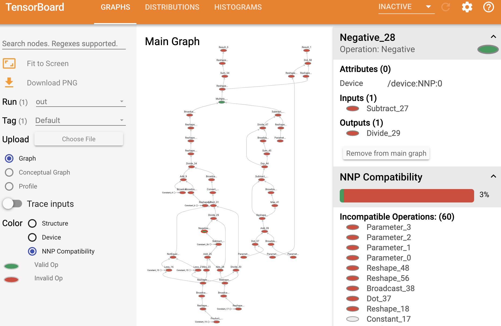
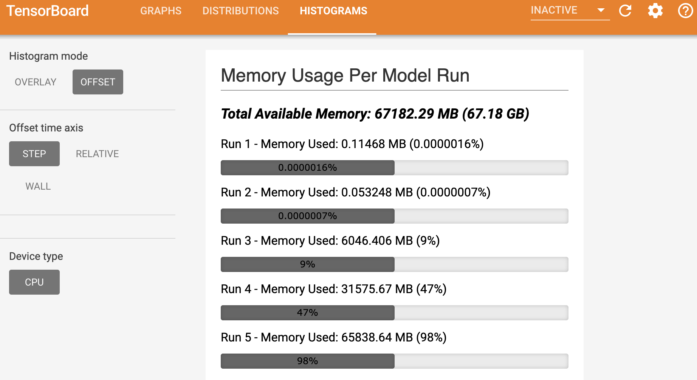

# Tensorboard Plugins for NNP Profiling

Follow these steps to build the demo plugins for NNP compatibility and memory usage in Docker. 

#### Clone this branch and navigate to the project directory
```
git clone https://github.com/mhbuehler/tensorboard.git tensorboard_mhb
cd tensorboard_mhb
```

#### Build a Docker container for Bazel 0.24.1 
Using the Dockerfile provided, build an image with the Tensorboard 1.14 build environment:
```
docker build \
    -f tensorboard/plugins/Dockerfile \
    -t bazel:0.24.1 \
    --build-arg http_proxy=${http_proxy} \
    --build-arg https_proxy=${https_proxy} .
```

#### Run a container with mounted volumes for the project and the sample data
```
docker run \
    -it \
    -v $PWD:/tensorboard \
    -v $PWD/tensorboard/plugins/sample_date:/tmp \
    -p 6006:6006 \
    --name nnp_plugins \
    bazel:0.24.1
```

#### Build the histogram demo and run Tensorboard in the container
```
cd tensorboard
bazel run tensorboard/plugins/histogram:histograms_demo
bazel run tensorboard -- --logdir=/tmp
```

#### In a local browser, go to `http://localhost:6006/`
You will see the "Graphs" view and compatibility checker first. Click the graph nodes to see more information.


Click the "Histogram" tab to see the memory usage plugin.
